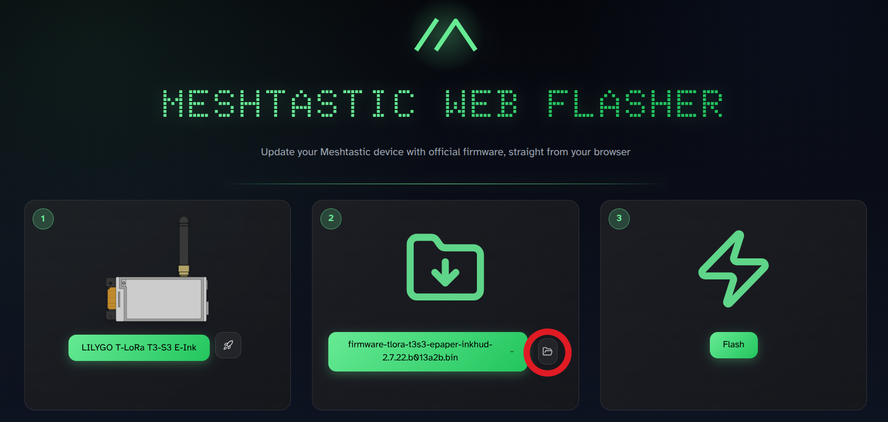

# InkHUD Lite

This repo curates and extends Meshtastic's InkHUD UI, observing with the [original design principles](/src/graphics/niche/InkHUD/docs/README.md#design-principles):

> InkHUD is a minimal UI for E-Ink devices. It displays the user's choice of info, as statically as possible, to minimize the amount of display refreshing.
>
> It is intended to supplement a connected client app.

InkHUD Lite contains absolutely no content generated by AI tools.

## Installation

### NRF52 Devices

Use the <a href="https://meshtastic.org/docs/getting-started/flashing-firmware/nrf52/drag-n-drop/">"drag-n-drop"</a> method with the downloaded `.uf2` file.

### ESP32 Devices

Visit <a href="https://flasher.meshtastic.org/">https://flasher.meshtastic.org/</a> and manually select either the `.bin` or `.factory.bin` file from the downloaded zip.

